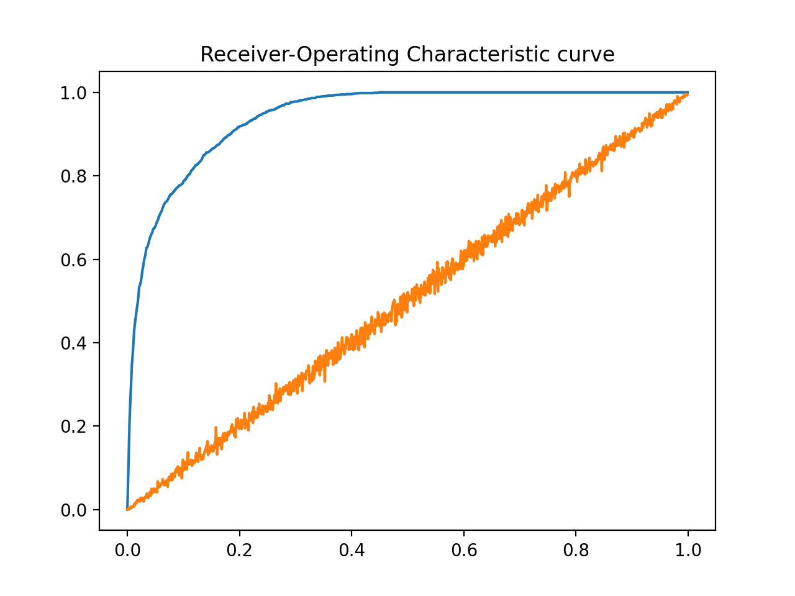
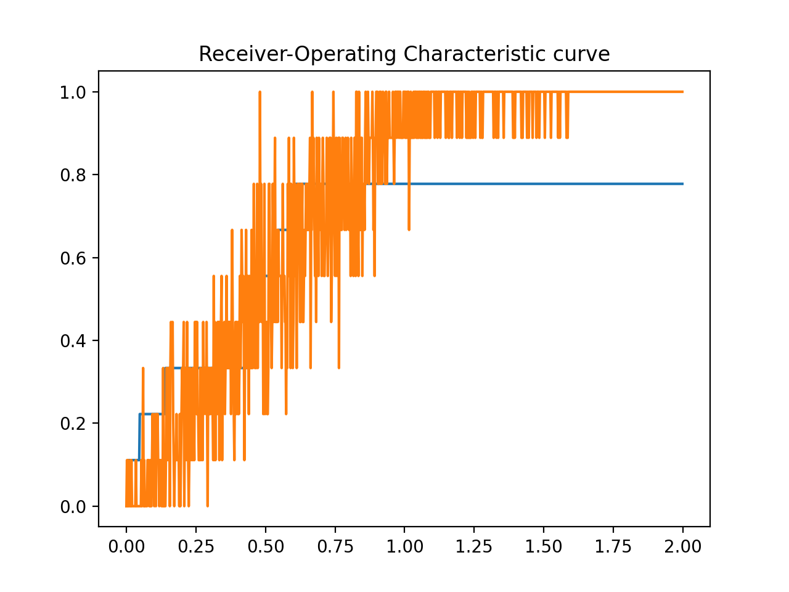

# Methods Part 1

Describe one or more appropriate predictive modeling approaches you chose to use for the dataset, taking into account the additional information if any

- Submit a draft of your **code** for building at least one predictive model and estimating its accuracy using **cross-validation**. It should also plot a **Receiver-Operating Characteristic curve**.

## Data Set

- Independent variable: Small Mol Concentration
- Dependent variable: Increased Fraction Dead

## Predictive Model

### Linear Regression

My code is [here](regression.py)

$$
h_\theta(x)=\sum_{i=1}^{n}\theta_ix_i=\theta^Tx\\
y^{(i)}=\theta^Tx^{(i)}+\varepsilon^{(i)}\\
$$

### Fitting with matrix

Try to minimize:
$$
\begin{align*}

J(\theta) &= \frac{1}{2}\sum_{i=1}^{m}(h_\theta(x^{(i)})-y^{(i)})^2\\
&= \frac{1}{2}(X\theta-Y)^T(X\theta-Y)\\
&= \frac{1}{2}(X^T\theta^T-Y^T)(X\theta-Y)\\
&= \frac{1}{2}(X^T\theta^TX\theta - X^T\theta^TY - Y^TX\theta + Y^TY)\\
J(\theta)' &= \frac{1}{2}(2X^TX\theta - X^TY - X^TY + 0)\\
&= X^TX\theta - X^TY

\end{align*}
$$

When $J(\theta)'=0$:
$$
\theta = (X^TX)^{-1}X^TY
$$
ROC：

### Fitting with Gradient Descent

$$
\begin{align*}

J(\theta) &= \frac{1}{2}\sum_{i=1}^{m}(h_\theta(x^{(i)})-y^{(i)})^2\\
\frac{\partial}{\partial\theta_j}J(\theta) &= \frac{\partial}{\partial\theta_j}\frac{1}{2}(h_\theta(x)-y)^2\\
&= 2\cdot\frac{1}{2}(h_\theta(x)-y)\cdot\frac{\partial}{\partial\theta_j}(h_\theta(x)-y)\\
&= (h_\theta(x)-y)\cdot\frac{\partial}{\partial\theta_j}(\sum_{i=0}^{n}\theta_ix_i-y)\\
&= (h_\theta(x)-y)x_j

\end{align*}
$$

When $J(\theta)'=0$:
$$
\theta=\theta-\alpha\cdot\frac{\partial J(\theta)}{\partial\theta}
$$
$\alpha$ is learning rate: 
$$
Repeat until convergence\{\\
\theta_j:=\theta_j+\alpha\sum_{i=1}^{m}(y^{(i)}-h_\theta(x^{(i)}))x_j^{(i)}\\
\}
$$

I got a bad curve. Maybe I haven't found the suitable $\alpha$ and the suitable iteration times.

ROC:

