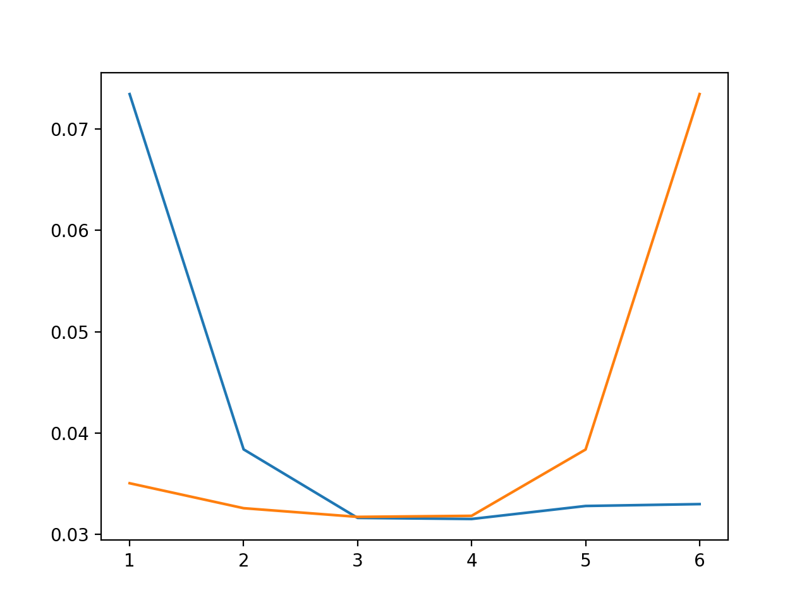

# Methods Part 2

- Independent variable: **Small Mol Concentration**

- Dependent variable: **Increased Fraction Dead**

- Predictive model: 

- Termination criterion:

- Active learning: **Pool-based active learning**

- Batch size: **1**

- Free parameters

- Learning curve:

  The X-axis is iteration times

  The Y-axis is mean squared error

  The blue line means choose the farthest point each time

  The yellow are opposite

  

