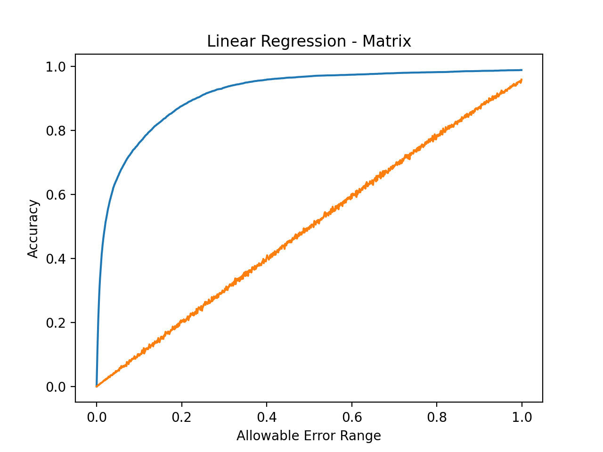
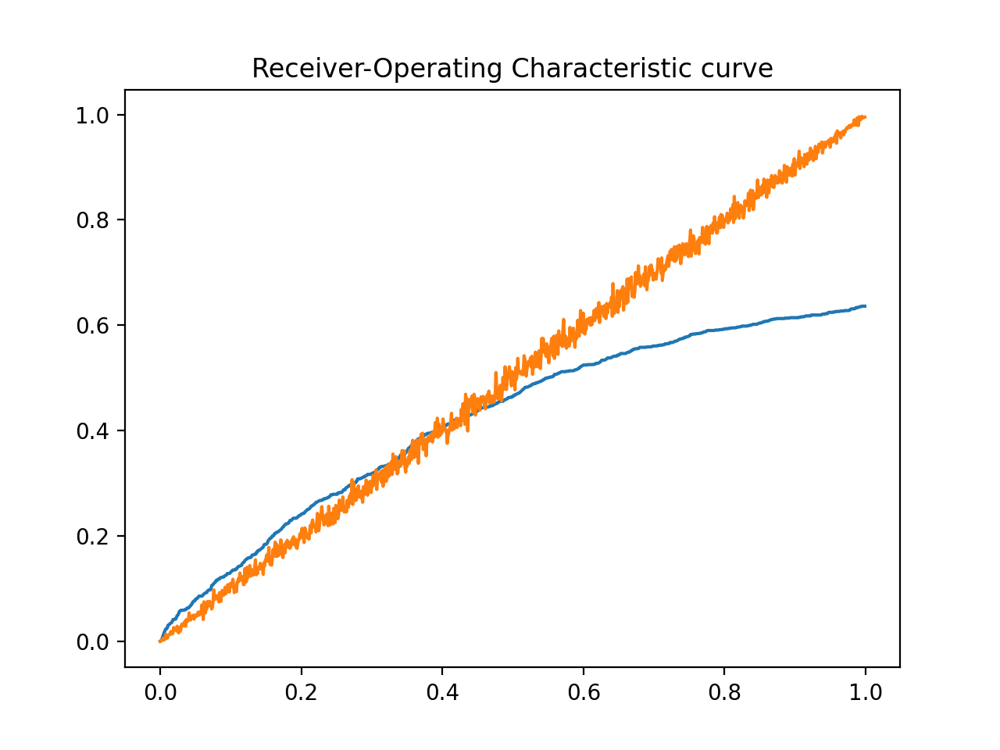
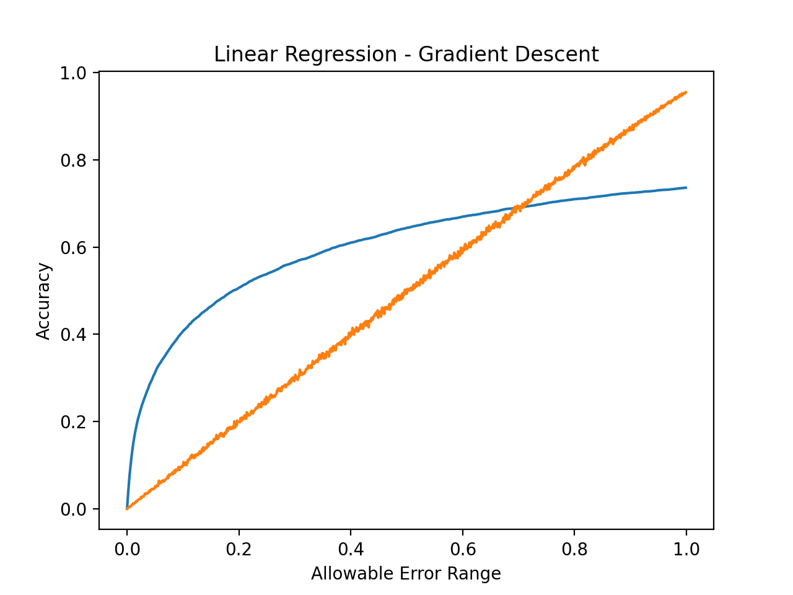
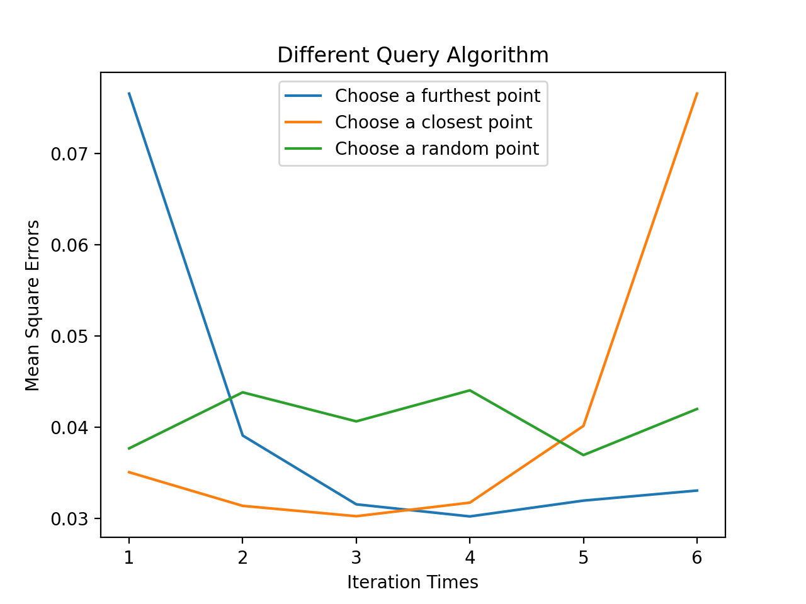
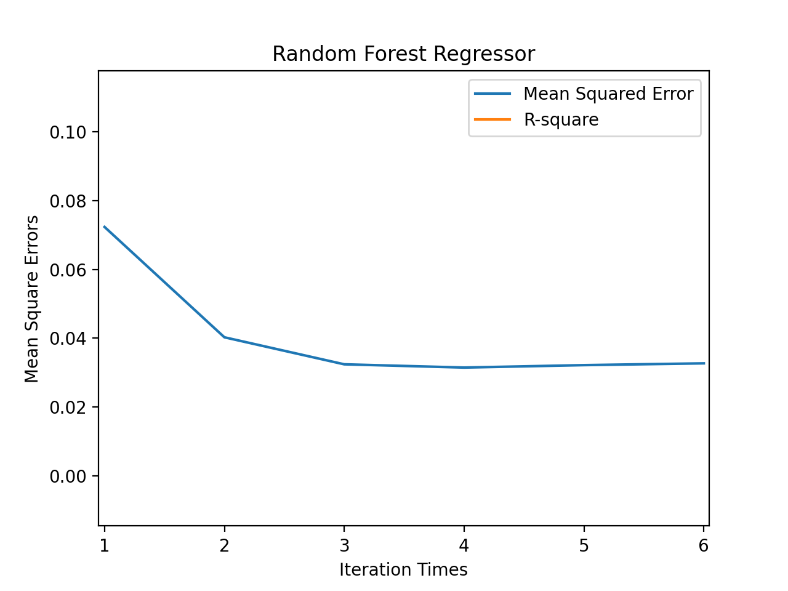

# Prediction of Drug Inhibition Probability Based on Active Learning

## Introduction

Hafner, M., M. Niepel, K. Subramanian and P. K. Sorger (2017). "Designing Drug-Response Experiments and Quantifying their Results." Curr Protoc Chem Biol 9(2): 96-116.

- Article link: https://dx.doi.org/10.1002/cpch.19
- Dataset description: https://lincs.hms.harvard.edu/db/datasets/20343/
- Dataset link: http://lincsportal.ccs.miami.edu/datasets/view/LDS-1518

The dataset measured the sensitivities of various cancer cell. A microscopy-based dose response assay was used to measure drug potency, and to quantify drug efficacy in terms of growth inhibition (GR metrics) and cell death. 

- Independent variable: **Small Mol Concentration**
- Dependent variable: **Increased Fraction Dead**

## Predictive modeling method

The approach used for predictive modeling is linear regression. One of the reasons to choose this approach is that accurate values are required to process regression equation and fit the actual data. And the other is the monotonicity between the independent variables and the dependent variables.

#### Least Squares Method

The method of least squares is a standard approach in regression analysis to approximate the solution of overdetermined systems (sets of equations in which there are more equations than unknowns) by minimizing the sum of the squares of the residuals made in the results of every single equation.

The model function has the follow form, where $h_\theta(x^{(i)})$ represents the predicted value of each sample through the model, $y^{(i)}$ represents the real value of each sample label, and $m$ is the number of samples.[[1]](#refer-1) [[2]](#refer-2)
$$
J(\theta)=\frac{1}{2}\sum_{i=1}^{n}(h_\theta(x^{(i)})-y^{(i)})^2
$$

#### Least Squares By Means of Matrix

The equation can be deduced as:
$$
\begin{align*}

J(\theta) &= \frac{1}{2}\sum_{i=1}^{m}(h_\theta(x^{(i)})-y^{(i)})^2\\
&= \frac{1}{2}(X\theta-Y)^T(X\theta-Y)\\
&= \frac{1}{2}(X^T\theta^T-Y^T)(X\theta-Y)\\
&= \frac{1}{2}(X^T\theta^TX\theta - X^T\theta^TY - Y^TX\theta + Y^TY)\\
J(\theta)'&= \frac{1}{2}(2X^TX\theta - X^TY - X^TY + 0)\\ 
&= X^TX\theta - X^TY

\end{align*}
$$

When $J(\theta)'=0$ , $\theta$ is obtained.
$$
X^TX\theta = X^TY\\
\theta=(X^TX)^{-1}X^TY
$$
Result:

#### Least Squares By Means of gradient descent[[3]](#refer-3)

$$
\begin{align*}

J(\theta) &= \frac{1}{2}\sum_{i=1}^{m}(h_\theta(x^{(i)})-y^{(i)})^2\\
\frac{\partial}{\partial\theta_j}J(\theta)&= \frac{\partial}{\partial\theta_j}\frac{1}{2}(h_\theta(x)-y)^2\\
&= 2\cdot\frac{1}{2}(h_\theta(x)-y)\cdot\frac{\partial}   {\partial\theta_j}(h_\theta(x)-y)\\
&= (h_\theta(x)-y)\cdot\frac{\partial}{\partial\theta_j}(\sum_{i=0}^{n}\theta_ix_i-y)\\
&= (h_\theta(x)-y)x_j

\end{align*}
$$

 When $J(\theta)'=0$ , $\theta=\theta-\alpha\cdot\frac{\partial J(\theta)}{\partial\theta}$ , $\alpha$ is learning rate.
$$
Repeat\ until\ convergence\{\\
\theta_j:=\theta_j+\alpha\sum_{i=1}^{m}(y^{(i)}-h_\theta(x^{(i)}))x_j^{(i)}\\
\}
$$

The difficulty of gradient descent is to find a suitable learning rate. If the learning rate is set too small, a lot of time will be used to converge. If the learning rate is set larger, the result will oscillate around the minimum but cannot converge to the minimum point. After many attempts, better results are estimated to be obtained when the learning rate is 0.001.

Before fitting parameters:

After fitting parameters:

## Active learning method

- Paradigm: pool-based active learning

  As conditions are often restricted under scientific research background, the choice is better to be pool-based active learning. Retrain when Query Algorithms selects a feature to simulate active learning.

- Predictive model: Linear Regression

- Batch size: 1

- Termination criterion：none

- Query algorithms: 

  Definition of *Distance*：for each feature in the pool, the Manhattan Distance[[4]](#refer-4) between it and each trained feature is calculated，where The shortest is the *Distance* between it and the features already tranied.

  Then there are 3 plans:
  
  1. Each time choose the one with the longest *Distance* for training.
  2. Each time Choose the one with the shortest *Distance* for training.
  3. Randomly choose one
  
  Using iteration times as the x-axis and mean square error as the y-axis. Therefore, the following figure can be obtained, where shows  that "selecting the longest distance for training" is the optimal and most suitable algorithm.
## Implementation

#### ROC-like Curve

Refer to Receiver-Operating Curve, one of the evaluation methods of classifier, a curve can be created with the allowable error range as horizontal axis（X-axis）and the accuracy rate as vertical axis（Y-axis). It offers a feasible way of evaluation to some extent, which has some similar characteristics with ROC.

#### Mean Squared Error

Mean squared error is applied to the evaluation as a measurement of the quality of an estimator. MSE is always strictly non-negative because of randomness or the bias of estimators. The MSE either assesses the quality of a predictor or of an estimator.[[5]](#refer-5)  In regression analysis, MSE over an out-of-sample test space, generated by a model estimated over a particular sample space, and it varies by sample and by out-of-sample test space.[[6]](#refer-6) The MSE equations are shown as below (if a vector of n predictions is generated from a sample of $n$ data points on all variables, and $Y_i$ is the vector of observed values of the variable being predicted, with $\hat{Y_i}$ being the predicted values or with respect to an unknown parameter $\theta$) :
$$
MSE=\frac{1}{n}\sum_{i=1}^{n}(Y_i-\hat{Y_i})^2\\
MSE(\hat{\theta})=E_{\theta}[(\hat{\theta}-\theta)^2]
$$

#### R-square

R-Squared as a statistical measure is used in the regression model during the valuation. It determines the proportion of variance in the dependent variable that can be explained by the independent variable. In other words, r-squared shows how well the data fit the regression model (the goodness of fit). [[7]](#refer-7)

The most common interpretation of r-squared is how well the regression model fits the observed data. For example, an r-squared of 60% reveals that 60% of the data fit the regression model. Generally, a higher r-squared indicates a better fit for the model. Normally, a high r-squared can indicate the problems with the regression model and a low r-squared figure is generally a bad sign for predictive models. [[8]](#refer-8)
$$
R_{squared}=\frac{SS_{Regression}}{SS_{Total}}
$$

## Results

## Reference 

- [1] Mansfield Merriman, "A List of Writings Relating to the Method of Least Squares"
- [2] Bretscher, Otto (1995). *Linear Algebra With Applications* (3rd ed.). Upper Saddle River, NJ: Prentice Hall.
- [3] Saad, Yousef (2003). [*Iterative methods for sparse linear systems*](https://archive.org/details/iterativemethods0000saad/page/195) (2nd ed.). Philadelphia, Pa.: Society for Industrial and Applied Mathematics. pp. [195](https://archive.org/details/iterativemethods0000saad/page/195). [ISBN](https://en.wikipedia.org/wiki/ISBN_(identifier)) [978-0-89871-534-7](https://en.wikipedia.org/wiki/Special:BookSources/978-0-89871-534-7).
- [4] Black, Paul E. ["Manhattan distance"](https://xlinux.nist.gov/dads/HTML/manhattanDistance.html). *Dictionary of Algorithms and Data Structures*. Retrieved October 6, 2019.
- [5] Probabilitycourse (2020, May 19). Mean Squared Error (MSE). Retrieved from https://www.probabilitycourse.com/chapter9/9_1_5_mean_squared_error_MSE.php
- [6] DeGroot, M. H., Schervish, M. J., Fang, X., Lu, L., & Li, D. (1986). Probability and statistics (Vol. 2). Reading, MA: Addison-Wesley.
- [7] Miles, J. (2014). R squared, adjusted R squared. *Wiley StatsRef: Statistics Reference Online*.
- [8] Gelman, Andrew, et al. "R-squared for Bayesian regression models." *The American Statistician* (2019).
